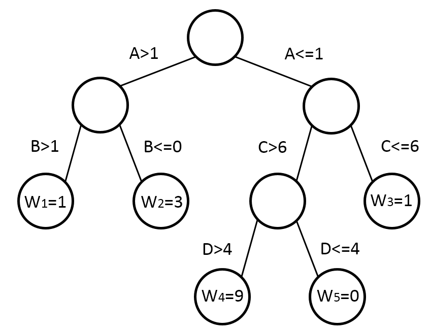
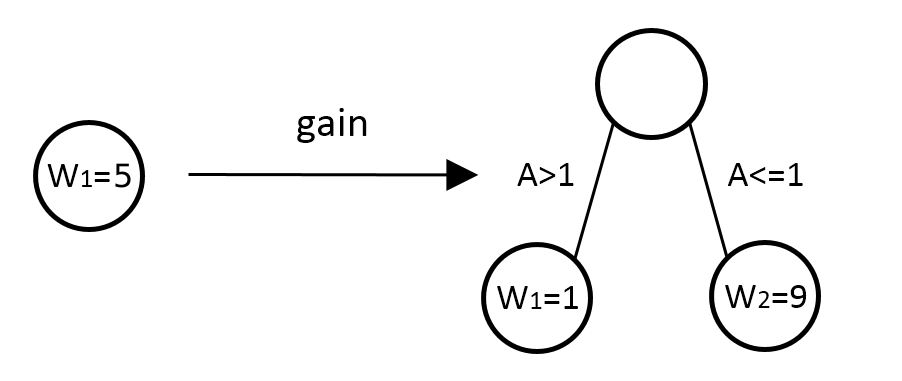
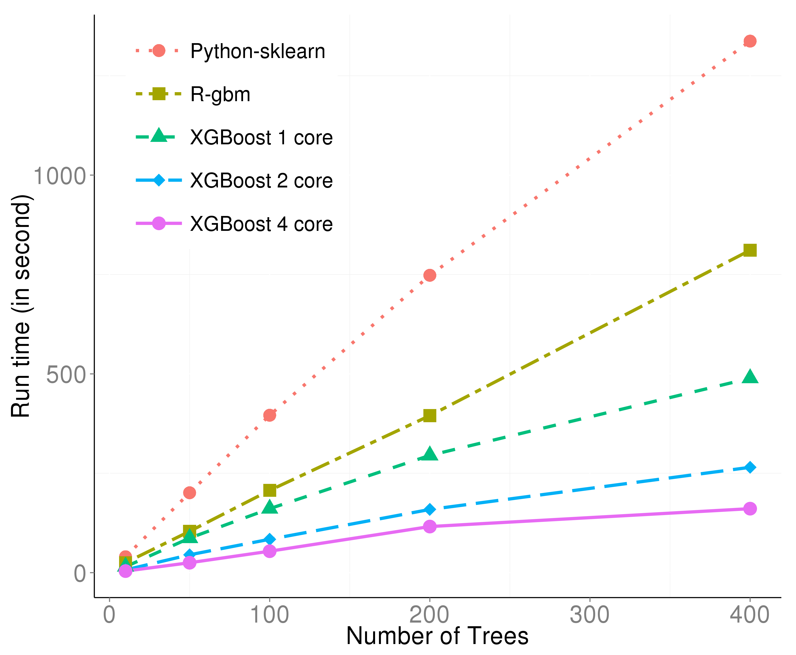

## Overview

- Introduction
- Basic Walkthrough
- Model Specification
- Implementation

--- .segue .dark

## Introduction

---

## Introduction

XGBoost is short for eXtreme Gradient Boosting. It is 

- An open-sourced tool
  - Computation in C++
  - R/python/Julia interface provided
- A variant of the gradient boosting machine
  - Tree-based model
- The winning model for several kaggle competitions

---

## Introduction

XGBoost is on [github](https://github.com/dmlc/xgboost).

- The primary author of the model and the c++ implementation is [Tianqi Chen](https://github.com/tqchen). 
- The author for the R-package is [Tong He](https://github.com/hetong007).
- Our paper "Higgs Boson Discovery with Boosted Trees" to appear on JMLR.

---

## Introduction

XGBoost is widely used for kaggle competitions. Because it is

- Easy to use
  - Easy to install.
  - Highly developed R/python interface for users.
- Efficient
  - Automatic parallel computation on a single machine.
  - Can be run on a cluster.
- Accurate
  - Good result for most data sets.
- Feasible
  - Customized objective and evaluation
  - Tunable parameters

---

## Basic Walkthrough

We introduce the R package for XGBoost. To install, please run


```r
devtools::install_github('dmlc/xgboost',subdir='R-package')
```

This command downloads the package from github and compile it automatically on your machine. 

---

## Basic Walkthrough

XGBoost provides a data set to demonstrate its usages.


```r
require(xgboost)
data(agaricus.train, package='xgboost')
data(agaricus.test, package='xgboost')
train = agaricus.train
test = agaricus.test
```

This data set includes the information for some kinds of mushrooms. The features are binary, indicate whether the mushroom has this characteristic. The target variable is whether they are poisonous. 

---

## Basic Walkthrough

Let's investigate the data first.


```r
str(train$data)
```

```
## Formal class 'dgCMatrix' [package "Matrix"] with 6 slots
##   ..@ i       : int [1:143286] 2 6 8 11 18 20 21 24 28 32 ...
##   ..@ p       : int [1:127] 0 369 372 3306 5845 6489 6513 8380 8384 10991 ...
##   ..@ Dim     : int [1:2] 6513 126
##   ..@ Dimnames:List of 2
##   .. ..$ : NULL
##   .. ..$ : chr [1:126] "cap-shape=bell" "cap-shape=conical" "cap-shape=convex" "cap-shape=flat" ...
##   ..@ x       : num [1:143286] 1 1 1 1 1 1 1 1 1 1 ...
##   ..@ factors : list()
```

We can see that the data is a `dgCMatrix` class object. This is a sparse matrix class from the package `Matrix`. Sparse matrix is more memory efficient for some specific data.

---

## Basic Walkthrough

To run XGBoost, we can use the following command:


```r
bst = xgboost(data = train$data, label = train$label,
              nround = 2, objective = "binary:logistic")
```

```
## [0]	train-error:0.000614
## [1]	train-error:0.001228
```

The output is the classification error on the training data set.

---

## Basic Walkthrough

Sometimes we might want to measure the classification by 'Area Under the Curve':


```r
bst = xgboost(data = train$data, label = train$label, nround = 2, 
              objective = "binary:logistic", eval_metric = "auc")
```

```
## [0]	train-auc:0.999238
## [1]	train-auc:0.999238
```

---

## Basic Walkthrough

To predict, you can simply write


```r
pred = predict(bst, test$data)
head(pred)
```

```
## [1] 0.2582498 0.7433221 0.2582498 0.2582498 0.2576509 0.2750908
```

---

## Basic Walkthrough

Cross validation is an important method to measure the model's predictive power, as well as the degree of overfitting. XGBoost provides a convenient function to do cross validation in a line of code.


```r
cv.res = xgb.cv(data = train$data, nfold = 5, label = train$label, nround = 2, 
                objective = "binary:logistic", eval_metric = "auc")
```

```
## [0]	train-auc:0.998856+0.000316	test-auc:0.998480+0.001088
## [1]	train-auc:0.999046+0.000611	test-auc:0.998480+0.001088
```

Notice the difference of the arguments between `xgb.cv` and `xgboost` is the additional `nfold` parameter. To perform cross validation on a certain set of parameters, we just need to copy them to the `xgb.cv` function and add the number of folds.

--- .segue .dark

## Model Specification

---

## Training Objective

Our model can be described as "the sum of some decision trees".

Suppose we have $K$ trees, the model is 

$$\sum_{k=1}^K f_k$$

where each $f_k$ is a decision tree. The model is a collection of decision trees.

---

## Tree Building Algorithm

Every decision tree looks like this



Each data point flows to one of the leaves following the direction on each node.


---

## Training Objective

Having all the decision trees, we make prediction by

$$\hat{y_i} = \sum_{k=1}^K f_k(x_i)$$

where $x_i$ is the feature vector for the $i$-th data point.

We add one tree in each iteration. At the $t$-th step the prediction is

$$\hat{y_i}^{(t)} = \sum_{k=1}^t f_k(x_i)$$

---

## Training Objective

To train the model, we need to optimize a loss function. 

Typically, we use

- Rooted Mean Squared Error for regression
    - $L = \frac{1}{N}\sum_{i=1}^N (y_i-\hat{y_i})^2$
- LogLoss for binary classification
    - $L = -\frac{1}{N}\sum_{i=1}^N (y_i \log(p_i)+(1-y_i)\log(1-p_i))$
- mlogloss for multi-classification
    - $L = -\frac{1}{N}\sum_{i=1}^N \sum_{j=1}^M y_{i,j} \log(p_{i,j})$

---

## Training Objective

Regularization is another important part of the model. A good regularization term controls the complexity of the model which prevents overfitting.

Define

$$\Omega = \gamma T + \frac{1}{2}\lambda \sum_{j=1}^{T} w_j^2$$

where $T$ is the number of leaves, and $w_j^2$ is the score on the $j$-th leaf.

---

## Training Objective

Put loss function and regularization together, we have the objective of the model:

$$Obj = L+\Omega$$

where loss function controls the predictive power, and regularization controls the simplicity.

---

## Training Objective

In XGBoost, we use gradient descent to optimize the objective. 

Given an objective $Obj(y,\hat{y})$ to optimize, gradient descent is an iterative technique which calculate 

$$\partial_{\hat{y}} Obj(y,\hat{y})$$

at each iteration. Then we improve $\hat{y}$ along the direction of the gradient to minimize the objective.

---

## Training Objective

Recall the definition of objective $Obj = L+\Omega$. For a iterative algorithm we can re-define the objective function as

$$Obj^{(t)} = \sum_{i=1}^N L(y_i,\hat{y}_i^{(t)})+\sum_{i=1}^t \Omega(f_i)
          = \sum_{i=1}^N L(y_i,\hat{y_i}^{(t-1)}+f_t(x_i))+\sum_{i=1}^t \Omega(f_i)$$

To optimize it by gradient descent, we need to calculate the gradient. The performance can also be improved by considering both the first and the second order gradient.

$$\partial_{\hat{y_i}^{(t)}} Obj^{(t)}$$
$$\partial^2_{\hat{y_i}^{(t)}} Obj^{(t)}$$

---

## Training Objective

Since we don't have derivative for every objective function, we calculate the second order taylor approximation of it

$$Obj^{(t)} \simeq \sum_{i=1}^N [L(y_i,\hat{y}^{(t-1)}) + g_i f_t(x_i)+\frac{1}{2}h_i f_t^2(x_i)] + \sum_{i=1}^t \Omega(f_i)$$


where 

- $g_i = \partial_{\hat{y}^{(t-1)}}l(y_i,\hat{y}^{(t-1)})$
- $h_i = \partial^2_{\hat{y}^{(t-1)}}l(y_i,\hat{y}^{(t-1)})$

---

## Training Objective

Remove the constant terms, we get 

$$Obj^{(t)} = \sum_{i=1}^n [g_i f_t(x_i)+\frac{1}{2}h_i f_t^2(x_i)] + \Omega(f_t)$$

This is the objective at the $t$-th step. Our goal is to find a $f_t$ to optimize it.

--- 

## Tree Building Algorithm

The tree structures in XGBoost leads to the core problem: 

how can we find a tree that improves the prediction along the gradient?

---

## Tree Building Algorithm

Every decision tree looks like this


Each data point flows to one of the leaves following the direction on each node.

---

## Tree Building Algorithm

The core concepts are:

- Internal Nodes
  - Each internal node split the flow of data points by one of the features.
  - The condition on the edge specifies what data can flow through.
- Leaves
  - Data points reach to a leaf will be assigned a weight.
  - The weight is the prediction.

---

## Tree Building Algorithm

Two key questions for building a decision tree are

1. How to find a good structure?
2. How to assign prediction score?

---

## Tree Building Algorithm

Let us assume that we already have the solution to question 1. 

We can mathematically define a tree as 

$$f_t(x) = w_{q(x)}$$

where $q(x)$ is a "directing" function which assign every data point to the $q(x)$-th leaf. 

This definition describes the prediction process on a tree as

- Assign the data point $x$ to a leaf by $q$
- Assign the corresponding score $w_{q(x)}$ on the $q(x)$-th leaf to the data point.

---

## Tree Building Algorithm

Define the index set 

$$I_j = \{i|q(x_i)=j\}$$

This set contains the indices of data points that are assigned to the $j$-th leaf.

---

## Tree Building Algorithm

Then we rewrite the objective as

$$Obj^{(t)}=\sum^n_{i=1} [g_if_t(x_i)+\frac{1}{2}h_if_t^2(x_i)]+\gamma T + \frac{1}{2}\lambda\sum^T_{j=1}w_j^2\\
         =\sum^T_{j=1}[(\sum_{i\in I_j} g_i)w_j+\frac{1}{2}(\sum_{i\in I_j} h_i+\lambda)w_j^2]+\gamma T$$

Since all the data points on the same leaf share the same prediction, this form sums the prediction by leaves.

---

## Tree Building Algorithm

It is a quadratic problem of $w_j$, so it is easy to find the best $w_j$ to optimize $Obj$.

$$w_j^\ast = -\frac{\sum_{i\in I_j} g_i}{\sum_{i\in I_j} h_i+\lambda}$$

The corresponding value of $Obj$ is

$$Obj^{(t)} = - \frac{1}{2} \sum^T_{j=1}\frac{(\sum_{i\in I_j} g_i)^2}{\sum_{i\in I_j} h_i + \lambda}+\gamma T$$

---

## Tree Building Algorithm

The leaf score

$$w_j = -\frac{\sum_{i\in I_j} g_i}{\sum_{i\in I_j} h_i+\lambda}$$

relates to

- The first and second order of the loss function $g$ and $h$
- The regularization parameter $\lambda$

---

## Tree Building Algorithm

Now we come back to the first question: How to find a good structure?

We can further split it into two sub-questions:

1. How to choose the feature to split?
2. When to stop the split?

---

## Tree Building Algorithm


Everytime we do a split, we are changing a leaf into an internal node.



---

## Tree Building Algorithm

In each split, we want to greedily find the best splitting point that can optimize the objective. 

For each feature

1. Sort the numbers
2. Scan the best splitting point. 
3. Calculate the gain for this split

Choose the feature optimizes the $Obj$.

---

## Tree Building Algorithm

Let 

- $I$ be the set of indices of data points assigned to this node
- $I_L$ and $I_R$ be the sets of indices of data points assigned to two new leaves.

Recall the best value of objective on the $j$-th leaf is

$$Obj^{(t)} = - \frac{1}{2} \frac{(\sum_{i\in I_j} g_i)^2}{\sum_{i\in I_j} h_i + \lambda}+\gamma $$

---

## Tree Building Algorithm

The gain of the split is

$$gain =\frac{1}{2} \left[\frac{(\sum_{i\in I_L} g_i)^2}{\sum_{i\in I_L} h_i + \lambda}+\frac{(\sum_{i\in I_R} g_i)^2}{\sum_{i\in I_R} h_i + \lambda} - \frac{(\sum_{i\in I} g_i)^2}{\sum_{i\in I} h_i + \lambda}\right] - \gamma$$

---

## Tree Building Algorithm

To build a tree, we 

- Start from the root
    - Find the best splitting point recursively 
- Until we reach to a full binary tree of the maximum depth
- Prune out the leaves with a negative gain in a bottom-up order.

---

## Tree Building Algorithm

XGBoost can handle missing values in the data. 

The model learns a "default direction" on each node:

- Guide all the missing value to 
    - the left sub-node, calculate the maximum gain
    - the right sub-node, calculate the maximum gain
- Choose the direction with larger gain

---

## Tree Building Algorithm

To sum up, the outline of the algorithm is 

- Iterate for $K$ times
    - Grow the tree to the maximun depth
        - Find the best splitting point
        - Assign weight to the two new leaves
    - Prune the tree to delete nodes with negative gain

--- .segue .dark

## XGBoost Implementation

---

## Higgs Boson Competition

The debut of XGBoost was in the [higgs boson competition](https://www.kaggle.com/c/higgs-boson).

Tianqi introduced the tool along with [a benchmark code](https://www.kaggle.com/c/higgs-boson/forums/t/8184/public-starting-guide-to-get-above-3-60-ams-score) which achieved the top 10% at the beginning of the competition.

To the end of the competition, it was already the mostly used tool in that competition.

---

## Higgs Boson Competition

After some feature engineering and parameter tuning, one can achieve around 25th with a single model on the leaderboard. [This](https://no2147483647.wordpress.com/2014/09/17/winning-solution-of-kaggle-higgs-competition-what-a-single-model-can-do/) is an article written by a former-physist introducing his solution with a single XGBoost model.

On our post-competition attempts, we achieved 11th on the leaderboard with a single XGBoost model.

---

## Higgs Boson Competition

Besides the good performace, the efficiency is also a highlight of XGBoost.

The following plot shows the running time result on the Higgs boson data set.



---

## Kaggle Community

It is now one of the most popular tools on Kaggle.com.

It is used by the winner in

- [Otto Group Product Classification Challenge](https://www.kaggle.com/c/otto-group-product-classification-challenge)
    - 9-class classificiation by 93 anonymous features 
- [Tradeshift Text Classification](https://www.kaggle.com/c/tradeshift-text-classification)
    - Classify text blocks in documents
- [Microsoft Malware Classification Challenge (BIG 2015)](https://www.kaggle.com/c/malware-classification)
    - Nearly 500 GB data!

---

## Advanced Features

There are plenty of highlights in XGBoost:

- Customized objective and evaluation metric
- Prediction from cross validation
- Continue training on existing model
- Calculate and plot the variable importance
- Early Stopping

--- .segue .dark

## FAQ
